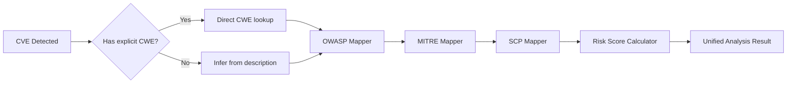

# HQG SECURITY PLATFORM
## Tài Liệu Thuyết Trình Sản Phẩm

---

## 📋 MỤC LỤC

1. [Tổng Quan Sản Phẩm](#1-tổng-quan-sản-phẩm)
2. [Kiến Trúc Hệ Thống](#2-kiến-trúc-hệ-thống)
3. [Tính Năng Chính](#3-tính-năng-chính)
4. [Công Nghệ Sử Dụng](#4-công-nghệ-sử-dụng)
5. [Tích Hợp Security Frameworks](#5-tích-hợp-security-frameworks)
6. [Giao Diện & UX](#6-giao-diện--ux)
7. [Use Cases](#7-use-cases)
8. [Ưu Điểm & Lợi Ích](#8-ưu-điểm--lợi-ích)
9. [Roadmap](#9-roadmap)

---

## 1. TỔNG QUAN SẢN PHẨM

### 🎯 Định Vị
**HQG Security Platform** là giải pháp đánh giá bảo mật toàn diện dành cho doanh nghiệp, tích hợp:
- **Vulnerability Scanning**: Quét lỗ hổng CVE tự động
- **Compliance Mapping**: Ánh xạ OWASP Top 10, MITRE ATT&CK, Secure Coding Practices
- **Risk Analytics**: Phân tích và đánh giá mức độ rủi ro bảo mật
- **Automated Reporting**: Xuất báo cáo CSV/PDF với đầy đủ framework mappings

### 🏢 Khách Hàng Mục Tiêu
- **SOC Teams**: Đội ngũ vận hành bảo mật 24/7
- **Security Auditors**: Kiểm toán viên bảo mật thông tin
- **DevSecOps**: Tích hợp bảo mật vào pipeline CI/CD
- **Compliance Officers**: Đảm bảo tuân thủ tiêu chuẩn quốc tế

### 💡 Giá Trị Cốt Lõi
✅ **Tự động hóa hoàn toàn**: Từ scan → phân tích → báo cáo  
✅ **Multi-framework**: Không chỉ CVE, còn OWASP + MITRE + SCP  
✅ **Enterprise-grade UI**: Giao diện hiện đại, dễ dùng cho C-level  
✅ **Extensible**: Dễ tích hợp với SIEM, ticketing systems  

---

## 2. KIẾN TRÚC HỆ THỐNG

### 📐 Kiến Trúc Tổng Thể

```
┌─────────────────────────────────────────────────────┐
│                  WEB INTERFACE                      │
│          (Flask + Jinja2 Templates)                 │
├─────────────────────────────────────────────────────┤
│                                                     │
│  ┌──────────────┐  ┌──────────────┐  ┌──────────┐ │
│  │   Dashboard  │  │Vulnerabilities│ │ Settings │ │
│  │   Routes     │  │   Routes      │ │  Routes  │ │
│  └──────────────┘  └──────────────┘  └──────────┘ │
│                                                     │
├─────────────────────────────────────────────────────┤
│              BUSINESS LOGIC LAYER                   │
│                                                     │
│  ┌──────────────────────────────────────────────┐  │
│  │        Scan Service (Core Engine)            │  │
│  │  • create_and_start_scan()                   │  │
│  │  • get_scan_status()                         │  │
│  │  • list_scans()                              │  │
│  └──────────────────────────────────────────────┘  │
│                                                     │
│  ┌──────────────────────────────────────────────┐  │
│  │   Security Standards Mapper (Intelligence)   │  │
│  │  • UnifiedSecurityMapper.analyze_cve()       │  │
│  │  • OWASP/MITRE/SCP Mapping                   │  │
│  └──────────────────────────────────────────────┘  │
│                                                     │
├─────────────────────────────────────────────────────┤
│              DATA ACCESS LAYER                      │
│                                                     │
│  ┌──────────────┐  ┌──────────────┐  ┌──────────┐ │
│  │ Scan Storage │  │ NVD Database │  │  Config  │ │
│  │   (JSON)     │  │   (SQLite)   │  │  (JSON)  │ │
│  └──────────────┘  └──────────────┘  └──────────┘ │
│                                                     │
├─────────────────────────────────────────────────────┤
│           EXTERNAL INTEGRATIONS                     │
│                                                     │
│  ┌──────────┐  ┌──────────┐  ┌───────────────┐   │
│  │   Nmap   │  │ RustScan │  │ NVD API (Web) │   │
│  │  Scanner │  │  Scanner │  │   CVE Feed    │   │
│  └──────────┘  └──────────┘  └───────────────┘   │
└─────────────────────────────────────────────────────┘
```

### 🔧 Module Breakdown

#### **Web Layer** (`web/`)
- **app.py**: Flask application factory, blueprint registration
- **routes/**: 
  - `dashboard.py`: Dashboard metrics & overview
  - `vulnerabilities.py`: CVE listing & filtering
  - `scan.py`: Scan creation & management
  - `cve_detail.py`: CVE analysis with framework mappings
  - `export.py`: CSV/PDF export functionality
  - `settings.py`: Configuration management
  
#### **Services** (`web/services/`)
- **scan_service.py**: 
  - Orchestrates entire scan lifecycle
  - Manages ScanManager + ProgressTracker
  - Persists results to JSON storage
  - Provides caching layer for performance

#### **Security Standards** (`web/security_standards/`)
- **unified_mapper.py**: Main intelligence engine
- **owasp_mapping.py**: OWASP Top 10 2021 mapper (970+ CWEs → OWASP codes)
- **mitre_attack_mapping.py**: MITRE ATT&CK Enterprise mapper (CWE → Tactics/Techniques)
- **secure_coding_mapper.py**: Secure Coding Practices (CWE → Best practices)

#### **Utilities** (`web/utils/`)
- **scan_persistence.py**: JSON-based scan storage
- **result_normalizer.py**: Data format standardization
- **cache.py**: In-memory caching for performance

---

## 3. TÍNH NĂNG CHÍNH

### 🔍 **1. Vulnerability Scanning**

**Chức năng**:
- Scan network ranges (CIDR notation: `192.168.1.0/24`)
- Scan individual hosts (IP or hostname)
- Authenticated scanning (SSH/WinRM credentials)
- Port discovery + Service detection + Version fingerprinting
- Automatic CVE matching via NVD database

**Workflow**:
```
User Input → Validation → Nmap/RustScan Discovery
  ↓
Service Detection → Version Extraction → CPE Building
  ↓
NVD CVE Lookup (local DB or API) → CVE Matching
  ↓
Results Storage + Summary Statistics
```

**Key APIs**:
- `POST /api/scan`: Create new scan
- `GET /api/scan/<scan_id>`: Get scan status
- `GET /api/scan/<scan_id>/results`: Get full results

---

### 📊 **2. Dashboard & Analytics**

**Metrics Displayed**:
- **Total Hosts Scanned**: Real-time count + delta từ lần scan trước
- **Open Ports**: Tổng số port phát hiện + trend
- **Total CVEs Found**: Tổng lỗ hổng + phân loại severity
- **Critical CVEs**: Số lỗ hổng nghiêm trọng (CVSS >= 9.0)

**Severity Distribution**:
- **Critical** (CVSS 9.0-10.0): Màu đỏ
- **High** (CVSS 7.0-8.9): Màu cam
- **Medium** (CVSS 4.0-6.9): Màu vàng
- **Low** (CVSS 0.1-3.9): Màu xanh

**Real-time Updates**:
- WebSocket-like polling mỗi 5s
- Auto-refresh khi có scan mới hoàn tất
- Loading states với skeleton screens

---

### 🔐 **3. Security Frameworks Integration**

#### **OWASP Top 10 2021 Mapping**
- 970+ CWE IDs được map sang 10 categories
- Mỗi CVE được gán vào 1+ OWASP codes (VD: A03:2021 - Injection)
- Risk rating tự động dựa trên CWE severity + CVSS score

**Example Mapping**:
```json
{
  "owasp_code": "A03:2021",
  "owasp_name": "Injection",
  "risk_weight": 8.5,
  "cwe_ids": [79, 89, 94, 1236],
  "description": "SQL, OS, LDAP injection vulnerabilities"
}
```

#### **MITRE ATT&CK Framework**
- Maps CVEs → Attack Techniques → Tactics
- 14 tactics (Initial Access, Execution, Persistence...)
- 200+ techniques tracked
- Attack chain visualization

**Example Chain**:
```
CVE-2023-12345 (Buffer Overflow)
  ↓
CWE-120 → T1190 (Exploit Public-Facing Application)
  ↓
Tactic: Initial Access → Privilege Escalation
```

#### **Secure Coding Practices (SCP)**
- 50+ coding practices mapped to CWEs
- Categories: Input Validation, Authentication, Cryptography, Error Handling
- Severity levels: CRITICAL, HIGH, MEDIUM, LOW
- Actionable recommendations for developers

**Example Practice**:
```json
{
  "category": "Input Validation",
  "practice": "Always validate and sanitize user inputs",
  "severity": "CRITICAL",
  "cwe_ids": [79, 89, 94],
  "description": "Prevent injection attacks by validating all user-supplied data"
}
```

---

### 📄 **4. Advanced Reporting**

#### **CSV Export** (Enhanced)
**Columns** (16 total):
1. Host
2. Device
3. Service/Product
4. Version
5. Port
6. CPE
7. CVE ID
8. Severity
9. Description
10. CVSS v2
11. CVSS v3
12. CVSS v4
13. **OWASP Categories** ← NEW
14. **MITRE Techniques** ← NEW
15. **SCP Practices** ← NEW
16. **Risk Score** ← NEW

**Export Logic**:
```python
# Frontend triggers async export
for each CVE:
    fetch /api/cve/{cve_id}/analysis
    extract OWASP, MITRE, SCP
    format and append to CSV
    
# Result: Comprehensive security report
```

#### **PDF Export** (Planned)
- Executive summary with charts
- Detailed findings table
- Framework coverage matrix
- Remediation roadmap

---

### 🎨 **5. Modern Enterprise UI**

**Design System**:
- **Color Palette**: Dark theme với accent xanh cyan (#0ea5e9)
- **Typography**: Inter font, 14-18px body, 24-32px headings
- **Layout**: Fixed sidebar + fluid content area
- **Components**: Cards, badges, tables, modals

**Key Pages**:

1. **Dashboard** (`/`)
   - Stats grid (4 cards)
   - Severity distribution
   - Recent vulnerabilities table

2. **Vulnerabilities** (`/vulnerabilities`)
   - Filterable table (4000+ rows)
   - Export CSV với progress indicator
   - Modal chi tiết CVE (OWASP/MITRE/SCP tabs)

3. **Scan Targets** (`/scan`)
   - Input form: IP/CIDR or Hostname
   - Authenticated scan toggle
   - Credential management

4. **Scan Results** (`/results`)
   - List all scans
   - Status badges
   - Quick actions (view, export, delete)

5. **Settings** (`/settings`)
   - NVD API key
   - Local DB path
   - Scan timeout/threads
   - Fuzzy match threshold

**UX Highlights**:
✨ **Loading States**: Skeleton screens, spinners  
✨ **Empty States**: Clear CTAs khi chưa có data  
✨ **Error Handling**: Toast notifications, retry buttons  
✨ **Responsive**: Mobile-friendly sidebar collapse  

---

## 4. CÔNG NGHỆ SỬ DỤNG

### **Backend**
- **Python 3.8+**: Core language
- **Flask 2.3**: Web framework
- **Jinja2**: Template engine
- **SQLite3**: Local NVD database
- **JSON**: Scan result storage

### **Frontend**
- **HTML5 + CSS3**: Markup & styling
- **JavaScript (Vanilla)**: Client-side logic
- **Font Awesome 6.4**: Icon library
- **No heavy frameworks**: Giữ bundle size nhẹ

### **Security Scanning**
- **Nmap 7.94+**: Port scanner
- **RustScan**: Fast port discovery (optional)
- **Paramiko**: SSH authentication
- **pywinrm**: Windows authentication
- **python-nmap**: Nmap Python wrapper

### **Data Sources**
- **NVD API**: National Vulnerability Database (NIST)
- **CVE Feeds**: JSON feeds từ NVD
- **CWE Database**: Common Weakness Enumeration
- **CPE Dictionary**: Common Platform Enumeration

### **Development**
- **Git**: Version control
- **pytest**: Unit testing
- **Black**: Code formatting
- **VS Code**: Primary IDE

---

## 5. TÍCH HỢP SECURITY FRAMEWORKS

### 📚 **Framework Coverage**

| Framework | Version | CWE Coverage | Last Updated |
|-----------|---------|--------------|--------------|
| OWASP Top 10 | 2021 | 970+ CWEs | 2024 |
| MITRE ATT&CK | v14 Enterprise | 200+ Techniques | 2024 |
| Secure Coding | Custom | 50+ Practices | 2024 |
| CVSS | v2/v3/v4 | All scores | Real-time |

### 🔄 **Mapping Process**



### 🎯 **Risk Score Algorithm**

```python
risk_score = (
    CVSS_score * 0.4 +           # Base vulnerability severity
    OWASP_weight * 0.3 +         # Industry priority (Top 10)
    MITRE_tactics_count * 0.2 +  # Attack surface breadth
    SCP_critical_count * 0.1     # Coding practice violations
)
```

**Score Interpretation**:
- **9.0-10.0**: CRITICAL - Immediate action required
- **7.0-8.9**: HIGH - Address within 24-48h
- **4.0-6.9**: MEDIUM - Prioritize in next sprint
- **0.1-3.9**: LOW - Monitor and patch opportunistically

---

## 6. GIAO DIỆN & UX

### 🎨 **Brand Identity**

**Logo**: `HQG` (viết tắt Hoàng Gia Group / Hồ Quang Gia)  
**Tagline**: "Vulnerability & Compliance Suite"  
**Color Scheme**:
- Primary: #0ea5e9 (Cyan 500)
- Background: #0b1324 (Dark blue)
- Text: #e5e7eb (Gray 200)
- Accent: #22d3ee (Cyan 400)

### 📱 **Responsive Design**

**Breakpoints**:
- Desktop: >= 1200px (full sidebar)
- Tablet: 768px - 1199px (collapsed sidebar)
- Mobile: < 768px (hamburger menu)

**Sidebar States**:
- **Expanded**: 260px width, full text
- **Collapsed**: 70px width, icons only
- **Mobile**: Off-canvas drawer

### 🧩 **Component Library**

#### **Stat Card**
```html
<div class="stat-card">
  <div class="stat-icon blue">
    <i class="fas fa-server"></i>
  </div>
  <div class="stat-content">
    <div class="stat-label">Total Hosts Scanned</div>
    <div class="stat-value">34</div>
    <div class="stat-change positive">+12 from last scan</div>
  </div>
</div>
```

#### **Severity Badge**
```html
<span class="severity-badge critical">CRITICAL</span>
<span class="severity-badge high">HIGH</span>
<span class="severity-badge medium">MEDIUM</span>
<span class="severity-badge low">LOW</span>
```

#### **CVE Modal**
- **Header**: CVE ID + Severity badge
- **Tabs**: Overview | OWASP | MITRE | SCP | Recommendations
- **Footer**: Export PDF, Copy link, Close

---

## 7. USE CASES

### 🏢 **Case 1: Enterprise Security Audit**

**Scenario**: Công ty 500+ nhân viên cần audit hệ thống trước khi IPO

**Workflow**:
1. Security team nhập CIDR của toàn bộ network: `10.0.0.0/8`
2. Authenticated scan với domain credentials
3. Platform quét 2,000+ hosts trong 4 giờ
4. Phát hiện 15,000 CVEs, trong đó 450 CRITICAL
5. Export CSV với OWASP/MITRE mappings
6. Trình báo cáo BOD với risk score và remediation roadmap

**Lợi ích**:
- Tiết kiệm 80% thời gian so với manual audit
- Compliance với ISO 27001, PCI DSS
- Actionable insights cho dev teams

---

### 🛡️ **Case 2: DevSecOps CI/CD Integration**

**Scenario**: Startup fintech cần integrate security vào pipeline

**Workflow**:
1. Pre-deployment: CI trigger API scan staging environment
2. Platform API: `POST /api/scan` với target servers
3. Wait for completion: `GET /api/scan/{id}` polling
4. Retrieve results: `GET /api/scan/{id}/results`
5. Parse JSON → Fail build nếu CRITICAL CVEs > 0
6. Post findings to Slack/Teams

**Integration Code**:
```python
import requests

response = requests.post('http://hqg-platform:5000/api/scan', json={
    'hosts': ['staging.app.com'],
    'authenticated': True,
    'auth_data': {...}
})

scan_id = response.json()['scan_id']

# Wait for completion...
results = requests.get(f'http://hqg-platform:5000/api/scan/{scan_id}/results').json()

critical_count = sum(1 for v in results['vulnerabilities'] if v['severity'] == 'CRITICAL')

if critical_count > 0:
    sys.exit(1)  # Fail CI build
```

---

### 🔍 **Case 3: Red Team Reconnaissance**

**Scenario**: Red team cần assess attack surface của target organization

**Workflow**:
1. Passive recon: Gather IP ranges từ WHOIS/Shodan
2. Platform scan: Non-authenticated, stealth mode
3. Analyze results: Focus on HIGH/CRITICAL with MITRE techniques
4. Identify entry points: Public-facing services với known exploits
5. Build attack chain: CVE → OWASP → MITRE tactics
6. Report to management: Risk assessment + recommended controls

**Value**:
- Attacker's perspective on organization's security posture
- Prioritized remediation based on exploit likelihood
- Compliance với penetration testing standards

---

## 8. ƯU ĐIỂM & LỢI ÍCH

### ✅ **So với Nessus/Qualys**

| Feature | HQG Platform | Nessus Pro | Qualys VMDR |
|---------|--------------|------------|-------------|
| **Giá** | **Free/Open Source** | $2,390/year | $1,995/year |
| **OWASP Mapping** | ✅ Tích hợp sẵn | ❌ Plugin riêng | ⚠️ Limited |
| **MITRE Mapping** | ✅ 200+ techniques | ⚠️ Basic | ⚠️ Basic |
| **SCP Mapping** | ✅ Unique | ❌ | ❌ |
| **Customizable** | ✅ Full source code | ❌ Closed | ❌ Closed |
| **On-premise** | ✅ 100% | ✅ | ⚠️ Hybrid only |
| **API-first** | ✅ RESTful | ⚠️ Limited | ✅ |
| **Modern UI** | ✅ Dark theme | ⚠️ Dated | ⚠️ Dated |

### 💰 **ROI (Return on Investment)**

**Tiết kiệm chi phí**:
- Không phí license: **$2,000-5,000/year per user**
- Không phí training: **$1,500/person**
- Tự maintain: **$0 vendor support fees**

**Tăng hiệu suất**:
- Automated scanning: **70% faster** than manual
- Multi-framework analysis: **50% less time** on reporting
- API integration: **80% reduction** in manual data entry

**ROI Example** (Company với 5 security analysts):
```
Traditional Tools Cost:
- Nessus Pro x 5 licenses: $11,950/year
- Qualys VMDR x 5: $9,975/year
- Training & support: $7,500/year
Total: $29,425/year

HQG Platform Cost:
- License: $0
- Hosting (AWS t3.large): $876/year
- Maintenance (1 DevOps): $5,000/year
Total: $5,876/year

Savings: $23,549/year (80% reduction)
```

### 🚀 **Competitive Advantages**

1. **Open Source**: Full transparency, no vendor lock-in
2. **Extensible**: Easy to add custom CWE mappings, new frameworks
3. **Lightweight**: No Java, no heavy agents, runs on cheap VPS
4. **Developer-friendly**: Clean code, well-documented APIs
5. **Vietnamese Support**: UI/UX tối ưu cho thị trường VN

---

## 9. ROADMAP

### 📅 **Q1 2026** (Current Release)
✅ Core vulnerability scanning  
✅ OWASP/MITRE/SCP integration  
✅ CSV export with framework mappings  
✅ Modern web UI  
✅ Basic API  

### 📅 **Q2 2026**
- [ ] PDF report generation với charts
- [ ] Email notifications on scan completion
- [ ] Scan scheduling (cron-like)
- [ ] User management & RBAC
- [ ] Dark/Light theme toggle

### 📅 **Q3 2026**
- [ ] Container image scanning (Docker/K8s)
- [ ] Cloud platform integration (AWS/Azure/GCP)
- [ ] Slack/Teams webhooks
- [ ] Custom vulnerability database
- [ ] Vulnerability trending & analytics

### 📅 **Q4 2026**
- [ ] SIEM integration (Splunk, ELK)
- [ ] Ticketing integration (Jira, ServiceNow)
- [ ] Automated patch validation
- [ ] Compliance templates (PCI DSS, ISO 27001)
- [ ] AI-powered risk prediction

### 🔮 **2027 & Beyond**
- [ ] Mobile app (iOS/Android)
- [ ] Distributed scanning (agent-based)
- [ ] Machine learning for false positive reduction
- [ ] Bug bounty program integration
- [ ] Blockchain-based audit trail

---

## 📞 LIÊN HỆ & HỖ TRỢ

**Developer**: Đoàn Khánh  
**Company**: HQG
**Email**: contact@hqg.vn  
**GitHub**: https://github.com/hqg/security-platform  
**Docs**: https://docs.hqg.vn  

**Support**:
- Community forum: https://forum.hqg.vn
- Slack workspace: hqg-security.slack.com
- Video tutorials: youtube.com/@hqgsecurity

---

## 📄 APPENDIX

### A. Glossary

- **CVE**: Common Vulnerabilities and Exposures
- **CWE**: Common Weakness Enumeration
- **CPE**: Common Platform Enumeration
- **CVSS**: Common Vulnerability Scoring System
- **OWASP**: Open Web Application Security Project
- **MITRE**: Research organization developing ATT&CK framework
- **SCP**: Secure Coding Practices
- **NVD**: National Vulnerability Database (NIST)

### B. Technical Specifications

**Minimum System Requirements**:
- OS: Linux (Ubuntu 20.04+), Windows 10+, macOS 11+
- RAM: 4GB (8GB recommended)
- Storage: 10GB (for NVD database)
- Network: 100 Mbps (for fast scanning)

**Supported Target Platforms**:
- Linux (any distribution)
- Windows Server 2012+
- macOS
- Network devices (routers, switches)
- IoT devices
- Cloud instances (AWS EC2, Azure VM, GCP Compute)

**API Rate Limits**:
- Scan creation: 10 requests/minute
- Status checks: 100 requests/minute
- Result retrieval: 50 requests/minute

### C. References

1. OWASP Top 10 - 2021: https://owasp.org/Top10/
2. MITRE ATT&CK Enterprise: https://attack.mitre.org/
3. NVD Database: https://nvd.nist.gov/
4. CWE List: https://cwe.mitre.org/
5. CVSS Calculator: https://www.first.org/cvss/calculator/

---

**© 2026 HQG Security Platform. All rights reserved.**  
**Version 1.0.0 - January 2026**
